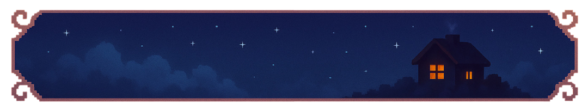

# LuckySky-Opalium

Paper 1.21.10 Plugin für das LuckySky-Minigame von Opalium.  
Bietet Spielsteuerung, Plattform-Utilities, automatische Lucky-Block-Spawns, Countdown- / Reward-Systeme, Wither-Events und vollständige In-Game-GUIs.

---

## ⚙ Konfiguration & Provisioning
- **Zentrale Blaupause:** `game.yml` bündelt Welt-Spawnpunkte, Lucky-Block-Position, Rundendauer (inkl. Bossbar / Actionbar), Rewards, Lives, Spawns und Wither-Mode.  
- **GUI-Layouts:** `admin-gui.yml` und `player-gui.yml` lassen sich ohne Rebuild ändern.  
- **Provisioning-Workflow:** Welt-Template bereitstellen, Server starten, dann `/ls reload` ausführen, damit LuckySky `game.yml`, GUIs und Weltdefinitionen lädt.  
- **AccessGate:** erlaubt Zutritt in *LOBBY*, sperrt COUNTDOWN / RUN für Nicht-Whitelist-Spieler.  
- **Weltrotation / Lifecycle:** siehe [LuckySky-Weltrotation](docs/wiki/luckysky-weltrotation.md).

---

## 💡 Hauptfunktionen

| Symbol | Komponente | Beschreibung |
|:--:|:--|:--|
|  | **GameManager** | Koordiniert Start / Stop, lädt Welt, platziert Safe-Plattform, bindet Spieler, startet Lucky / Countdown / Wither-Services, verwaltet Teilnehmer. |
|  | **LuckyService** | Platziert periodisch den konfigurierten Lucky-Block-Typ an der Arena-Position. |
|  | **RewardService** | Führt Rewards / Fails aus, startet 60-Sekunden-Endtimer und setzt danach in LOBBY zurück. |

---

## 🖼 Galerie · Aurora Blue & Sunrise Gold

  
  
  
  
  

---

## 🎬 Trailer · Aurora Blue & Sunrise Gold
<figure>
  <video src="docs/images/luckysky/branding/docs/LuckySky-Catch.mp4"
         controls
         poster="docs/images/luckysky/branding/logo/LuckySky-Logo4.png"
         width="640">
    Dein Browser unterstützt keine Videoeinbettung.  
    <a href="docs/images/luckysky/branding/docs/LuckySky-Catch.mp4">Download LuckySky-Catch.mp4</a>
  </video>
  <figcaption>
    <strong>Aurora Blue</strong> und <strong>Sunrise Gold</strong> prägen die visuelle Identität von LuckySky.
  </figcaption>
</figure>

---

## 🧭 Dokumentation / Wiki

- [NPC-Depot](docs/wiki/npc-depot.md)  
- [Admin- & Player-GUIs](docs/wiki/admin-player-guis.md)  
- [LuckySky-Weltrotation](docs/wiki/luckysky-weltrotation.md)  
- [Duels Crystal PvP Builder](docs/wiki/duels-crystal-pvp-builder.md)  
- [Fallen-Handbuch](docs/wiki/fallen-handbuch.md)  
- [Permissions & LuckPerms-Setups](docs/wiki/permissions.md)

---

## 🧱 Build
- **Java 21 / Gradle 8.10+ / Paper 1.21.10**  
- Build-Pfad: `gradle build` → `build/libs/LuckySky-Opalium-0.1.0-SNAPSHOT.jar`  
- Keine externen Abhängigkeiten außer Paper API und Bukkit.

---

## 📦 Status
Aktueller Stand laut `docs/plugin-status.md`:  
Funktionierende Services, Rewards, GUIs und AccessGate.  
Arena-Helper (Rig / Corridor Automation, Warp Signage) folgen.

---

  
  
<strong>LuckySky · Opalium Haven Project</strong>

