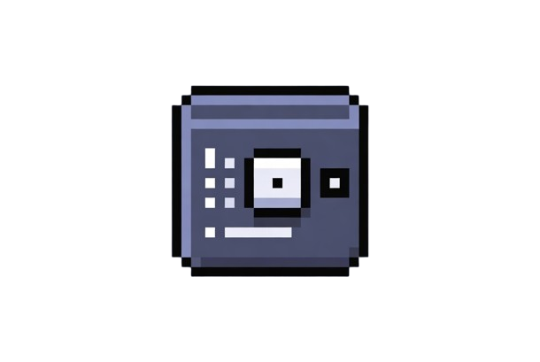
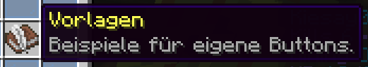

# Admin- und Player-GUIs

LuckySky stellt mehrere Inventar-basierte GUIs bereit, um Match- und Spieleraktionen ohne Chatbefehle zu verwalten. Dieser Artikel beschreibt Aufbau, Layout, Berechtigungen und Erweiterbarkeit. Alle Layouts liegen jetzt unter `config/gui/` und können ohne Rebuild angepasst werden.

| GUI | Konfigurationsdatei | Beschreibung |
| --- | --- | --- |
| LuckySky Admin | `config/gui/luckysky-admin.yml` | Vollständige Staff-Steuerung inkl. Rewards, Timer und Portalaktionen. |
| LuckySky Player | `config/gui/luckysky-player.yml` | Lobby-Menü für Spieler mit Join, Start-Votes und Scoreboard-Toggle. |
| Duels Admin | `config/gui/duels-admin.yml` | Schnelle Arena-, Reset- und Lichtsteuerung für LuckySky-Duels. |
| Duels Player | `config/gui/duels-player.yml` | Platzhalter für zukünftige spielerorientierte Duels-Menüs (aktuell leer, kann mit Layouts befüllt werden). |

## Admin-GUI

- **Aufruf:** `/luckysky admin` oder per Citizens-NPC-Interaktion.
- **Hotbar-Aktionen:** Buttons mit `actionbar:`-Tag zeigen kontextabhängige Hinweise (z. B. Countdown-Restzeit).
- **Konfiguration:** `config/gui/luckysky-admin.yml` definiert Layouts. Nutzen Sie `placeholder: true`, um künftige Buttons vorzubereiten.

### Registerkarten & Icon-Legende

| Symbol | Bereich | Schlüsselaktionen |
| --- | --- | --- |
|  | Matchkontrolle | Start/Stop, Welt-Reset, Timer-Schnellwahl |
|  | Gameplay-Optionen | Lucky-Block-Variante, Scoreboard, Taunts |
|  | Belohnungen | Erfolgs-/Fehlschlagsbefehle, Sofortauszahlung |
|  | Welt- & Wartungstools | Plattformbau, Portale, Entity-Wipes |
|  | Vorlagenverwaltung | Speichern/Laden von Arenavorlagen |

### Matchkontrolle

| Aktion | Screenshot |
| --- | --- |
| Countdown-Auswahl (5 Minuten) |  |
| Countdown-Auswahl (20 Minuten) |  |
| Sofortiger Stop & Lobby-Transfer |  |

### Gameplay-Optionen

| Funktion | Screenshot |
| --- | --- |
| Gameplay-Layout |  |
| Wither-Status toggeln |  |
| Sofort-Spawn des Withers |  |
| Scoreboard-Umschalter |  |
| Taunt-Auswahl |  |
| Variantenumschalter |  |

### Vorlagenverwaltung

| Aktion | Screenshot |
| --- | --- |
| Vorlagenübersicht |  |
| Vorlage sichern |  |
| Vorlage laden |  |

### Weltwerkzeuge

| Werkzeug | Screenshot |
| --- | --- |
| Weltübersicht |  |
| Portal öffnen |  |
| Portal schließen |  |
| Teleport zur Arena |  |

### Belohnungen & Ergebnisse

| Status | Screenshot |
| --- | --- |
| Erfolgreiche Reward-Auszahlung |  |
| Fehlgeschlagene Reward-Auszahlung |  |

## Player-GUIs

- **Queue-GUI:** Spieler wählen Spielmodus, Event-Varianten oder Training-Sessions aus. Das Interface ruft `/ls queue join <variante>` auf.
- **Loadout-GUI:** Ermöglicht kosmetische Einstellungen (z. B. Trails, Victory-Dances). Optional in `config.yml` deaktivierbar.
- **Duels-GUI:** Wird per `/luckysky duels` geöffnet und erlaubt das Binden von LuckySky-Varianten an Duels-Kits (siehe [Duels Crystal PvP Builder](duels-crystal-pvp-builder.md)).
- **Konfiguration:** Spielerbezogene Layouts liegen in `config/gui/luckysky-player.yml` (LuckySky) und `config/gui/duels-player.yml` (Duels, derzeit leer). Admin-spezifische Duels-Knöpfe werden separat in `config/gui/duels-admin.yml` gepflegt.

## Permissions

- `luckysky.gui.admin`: Vollzugriff auf die Admin-GUI samt gefährlicher Aktionen (Wipes, Timer-Resets).
- `luckysky.gui.staff`: Zugriff auf Matchkontrolle, jedoch ohne Wipe/Belohnungs-Tabs.
- `luckysky.gui.players`: Öffnet die Player-GUI-Sammlung, inklusive Queue- und Loadout-GUI.
- `luckysky.gui.queue.bypass`: Überspringt Cooldowns beim erneuten Betreten der Queue.
- `opalium.luckysky.duels.mod`: Öffnet das Duels-Admin-Menü `/duelsui`.

## Erweiterung

1. **Neuer Button:** Fügen Sie in `config/gui/luckysky-admin.yml` oder dem jeweiligen Player-/Duels-Layout einen Slot-Eintrag hinzu, inklusive `commands:`-Liste. Unterstützt mehrere Befehle.
2. **API-Hooks:** Verwenden Sie `LuckySkyAdminGui#registerExtension`, um neue Tabs zur Laufzeit hinzuzufügen.
3. **Übersetzungen:** Texte werden über `messages.yml` geladen; passen Sie dort Lore und Titel an.

## Fehlerbehebung

- Wenn das GUI nicht öffnet, prüfen Sie den Permission-Pfad (LuckPerms `lp user <name> permission info`).
- Inventare schließen sofort, wenn die Aktion serverseitig fehlschlägt. Kontrollieren Sie dann die Server-Konsole auf Exceptions.
